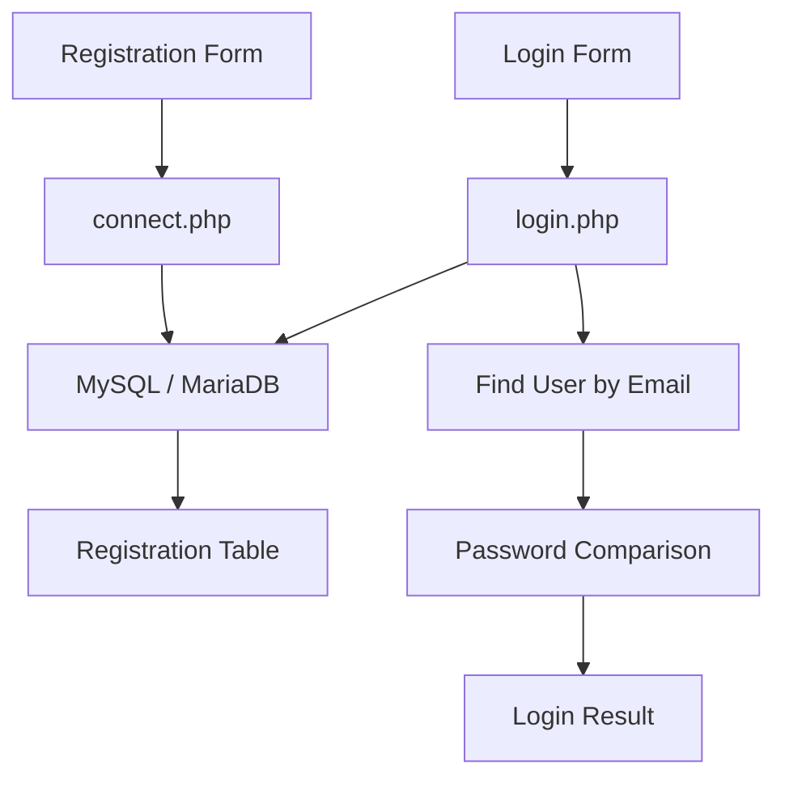

# Signup & Login System with Working Database

A basic **PHP + MySQL/MariaDB registration and login demonstration**.

The repository contains separate registration and login forms, PHP database handlers, Bootstrap styling, and an SQL dump for the registration table.

## What the project does

### Registration

The registration form collects:

- First name
- Last name
- Gender
- Email
- Password
- Phone number

The form submits to `Registration form/connect.php`.

That PHP file reads the submitted values, connects with MySQLi, uses a prepared INSERT statement, writes the record to the registration table, and reports success or failure.

### Login

The login form collects email and password.

`login form/login.php` uses a prepared query to locate the registration row for the supplied email and then compares the submitted password with the stored value.

## Repository structure

```text
Signup-login-system-with-working-data-base/
├── Registration form/
│   ├── index.html
│   ├── connect.php
│   └── css/
├── login form/
│   ├── login.html
│   ├── login.php
│   └── css/
├── sai.sql
└── README.md
```

## Database

The supplied SQL dump defines database **sai** and a registration table containing:

- firstName
- lastName
- gender
- email
- password
- number

The SQL dump metadata identifies MariaDB 10.4.x / PHP 8.1.x tooling.

## Local setup

### Requirements

- PHP with MySQLi
- MySQL or MariaDB
- Apache for a typical XAMPP/WAMP setup
- A browser

### Database setup

1. Create a database named `sai`.
2. Import `sai.sql`.
3. Place the repository under your local web-server directory.
4. Start Apache and MySQL/MariaDB.
5. Open the registration page.

### Registration

Open `Registration form/index.html` and submit the form.

### Login

Open `login form/login.html` and submit an email and password.

## Important current-code notes

1. `Registration form/connect.php` connects to the **sai** database, while `login form/login.php` currently connects to **test**. Align the database name before using both flows together.
2. The SQL schema defines gender as `ENUM('male','female')`, while the HTML currently submits `m`, `f`, or `o`. The form and schema should be aligned.
3. Passwords are currently stored and compared directly. This is a learning/demo implementation, not production authentication.
4. The login script reports success/failure but does not create a persistent application session or protected dashboard.

## Security note

For production authentication, use password hashing with `password_hash()` / `password_verify()`, session management, CSRF protection, server-side validation, consistent database configuration, and secure secret handling.

## Links

- [GitHub Repository](https://github.com/pallasivasai/Signup-login-system-with-working-data-base)
- [SQL schema](https://github.com/pallasivasai/Signup-login-system-with-working-data-base/blob/main/sai.sql)


## 🏗️ Architecture



> **Current-code note:** the repository documents a database-name mismatch between the registration connection (`sai`) and login connection (`test`), so the two paths should be aligned before treating them as one production-ready flow.
